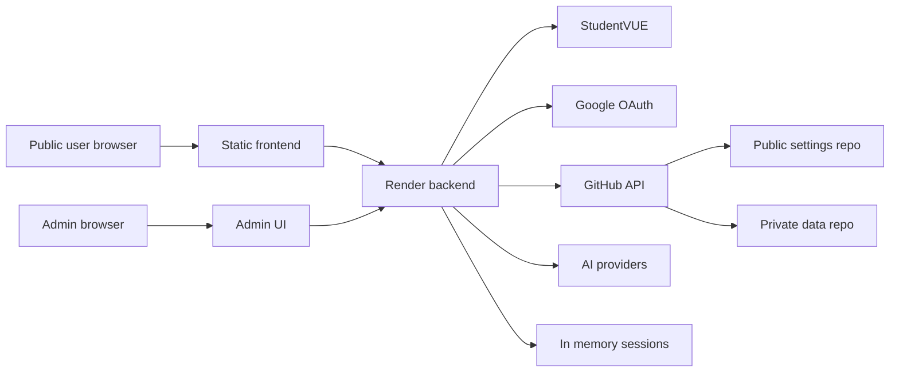

# PHS Grades Backend Threat Model

Generated: 2026-05-24 21:48:56 EDT

Remediation update: the live-fix worktree at `/Users/emirksi/Desktop/phs-grades-backend-live` now contains patches for the high/medium issues in this model, plus follow-up fixes from the independent subagent pass: root-scoped cross-site admin cookies, logout clearing both old/new cookie paths, future-dated schedule override preservation, lockfile-strict Render installs, analytics retention, and duplicate bell schedule validation cleanup. Verification after remediation included syntax checks, targeted invariant tests, production-mode curl probes, `npm audit --omit=dev --json` with 0 vulnerabilities, and `uvx semgrep --config=p/owasp-top-ten --config=p/secrets --exclude node_modules --exclude package-lock.json --quiet .` with no findings.

## Executive summary

The highest-risk themes found in the original audit were credential/session exposure across browser boundaries, uneven route-level security controls, and privileged admin features that can mutate public site state or spend AI/API resources. The live-fix worktree now patches the high/medium items called out here; the detailed threat entries below preserve the original evidence so the remediation can be reviewed against it.

## Scope and assumptions

- In scope: current GitHub/Render backend clone and live-fix worktree at `/Users/emirksi/Desktop/phs-grades-backend-live`, especially `app.js`, `lib/`, `admin-ui/`, `render.yaml`, `package.json`, and `package-lock.json`.
- In scope: static frontend consumption of backend settings and admin redirects from `/Users/emirksi/Desktop/schedule.phs-main`.
- Out of scope: stale local backend copy `/Users/emirksi/Desktop/phs-grades-backend-main` except as a "do not deploy" risk.
- Assumption: production backend is `https://phs-grades-backend.onrender.com`.
- Assumption: public frontend is mainly `https://poolesville.web.app` plus existing Firebase/GitHub Pages domains.
- Assumption: StudentVUE session/data remains sensitive even if the user is unsure whether it is still a core feature.
- Assumption: admin AI is core admin functionality, so it should not be tiny-rate-limited, but it still needs cost, payload, and abuse guardrails.

Open questions that would change risk ranking:

- Whether localhost origins are intentionally allowed in production.
- Whether StudentVUE proxy routes are still user-facing or legacy.
- Whether admin AI is used by only one trusted admin or by a broader staff group.

## System model

### Primary components

- Express backend server: routes and middleware in `app.js`.
- StudentVUE proxy/session layer: in-memory session map, StudentVUE request wrappers, cookie handling in `app.js`.
- Admin auth: Google token verification, in-memory admin sessions, bearer/cookie auth in `app.js` and `lib/admin-auth.js`.
- Admin UI: browser app in `admin-ui/login.js`, `admin-ui/admin.js`, and `admin-ui/admin.html`.
- Settings store: validation, merge/replace, GitHub durable write handling in `lib/settings.js`.
- Public settings publisher: filtered settings sync to the public frontend repository in `lib/public-settings-publisher.js`.
- Analytics/audit/backups: operational telemetry and settings snapshots in `lib/analytics.js`, `lib/audit.js`, and `lib/backups.js`.
- External providers: StudentVUE, Google OAuth tokeninfo, GitHub Contents API, Google Gemini, optional AI providers.

### Data flows and trust boundaries

- Browser -> Backend API:
  - Data: StudentVUE credentials, admin Google credentials, settings JSON, AI prompts/images, analytics events.
  - Channel: HTTPS.
  - Security: CORS allowlist, cookies/bearer token for admin, rate limits on some routes.
  - Validation: mixed per-route validation; settings schema is partial and accepts unknown keys.

- Backend -> StudentVUE:
  - Data: username/password, StudentVUE cookies, grade/schedule/document requests.
  - Channel: HTTPS via axios.
  - Security: allowed StudentVUE origin list, DNS private-IP rejection, resource path allowlist.
  - Validation: `prepareStudentVueDetails`, `assertAllowedStudentVueOrigin`, and `sanitizeStudentVuePath`.

- Backend -> Google OAuth:
  - Data: Google ID token credential.
  - Channel: HTTPS to tokeninfo.
  - Security: audience and verified email checks.
  - Validation: email allowlist, but no auth rate limiter on the Google-login endpoint.

- Admin Browser -> Admin UI:
  - Data: admin token, settings drafts, preview messages.
  - Channel: same-origin HTTPS.
  - Security: HttpOnly cookie exists, but token is also returned to JS and stored in localStorage.
  - Validation: preview postMessage handling lacks strict origin/source checks.

- Backend -> GitHub:
  - Data: settings, public settings, audit log, analytics, backups.
  - Channel: HTTPS Contents API with repository tokens.
  - Security: environment tokens, repo/branch/path configuration.
  - Validation: public publisher filters known public keys, but token fallback boundaries are broad.

- Backend -> AI providers:
  - Data: admin prompts, draft settings context, optional images.
  - Channel: HTTPS provider APIs.
  - Security: admin auth, Jarvis rate limiter only.
  - Validation: prompt instructions, patch allowlist, settings validation after model response.

#### Diagram

## Assets and security objectives

- StudentVUE credentials/session cookies: confidentiality; compromise exposes student school data.
- Student data returned by proxy routes: confidentiality; should only be readable by the authenticated user session.
- Admin session token/cookie: confidentiality and integrity; compromise allows public site changes and AI usage.
- Site settings and schedule override: integrity and availability; bad changes break public schedule behavior.
- GitHub tokens: confidentiality/integrity; compromise can modify private data or public settings.
- AI provider API keys and quota: confidentiality/availability/cost control.
- Audit logs/backups/analytics: integrity and privacy; logs should not leak secrets or grow unbounded.

## Attacker model

Capabilities:

- Remote internet user can send arbitrary HTTP requests to public backend routes.
- Malicious local-origin web app can run from `http://localhost:8080` or `http://127.0.0.1:8080` if the user opens/runs it.
- Attacker can attempt login abuse, CORS abuse, oversized payloads, malformed settings, and analytics spam.
- If an admin token leaks through XSS, extension compromise, or localStorage theft, attacker can access admin APIs.

Non-capabilities:

- Attacker is not assumed to know admin Google credentials.
- Attacker is not assumed to have direct Render environment variable access.
- Attacker is not assumed to control GitHub repository tokens unless another compromise occurs.

## Threat enumeration

### T1: Local-origin credentialed CORS abuse

Attack path: attacker gets a user/admin to open or run a malicious localhost page -> backend accepts the local origin with credentials -> browser sends cookies to StudentVUE/admin-adjacent endpoints -> attacker reads allowed CORS response data from an active session.

- Evidence: localhost origins are included in `DEFAULT_CORS_ALLOWED_ORIGINS` in `app.js:67-80`; credentials are enabled in `app.js:141-148`; StudentVUE cookie uses `SameSite=None` in production in `app.js:278-285`.
- Likelihood: medium. Requires a local-origin page/app but production currently allows it.
- Impact: high. Could expose active StudentVUE session data.
- Overall priority: high.

### T2: Admin token theft through JavaScript-accessible bearer token

Attack path: admin signs in -> backend sets HttpOnly cookie but also returns token in JSON -> admin UI stores token in localStorage -> any admin-page XSS or malicious extension can steal bearer token -> attacker calls admin APIs until session expiry.

- Evidence: token returned in `app.js:955-956`; token stored in `admin-ui/login.js:33` and `admin-ui/admin.js:408-409`; bearer header attached in `admin-ui/admin.js:261-267`.
- Likelihood: medium. Requires XSS/extension/local compromise, but localStorage makes impact easier.
- Impact: high. Admin APIs can publish settings, restore backups, upload assets, and invoke AI.
- Overall priority: high.

### T3: Pre-auth Google-login abuse

Attack path: attacker repeatedly posts bogus Google credentials -> backend calls Google tokeninfo and writes audit failures -> consumes backend/Google/network resources and pollutes logs.

- Evidence: `/admin/google-login` is at `app.js:930`; `authLimiter` exists at `app.js:167-173` but is not applied to this route.
- Likelihood: high. Public unauthenticated route.
- Impact: medium. Resource/log abuse, less likely direct account compromise.
- Overall priority: medium/high.

### T4: Admin AI image extraction cost/DoS after token compromise or admin misuse

Attack path: attacker obtains admin token or admin repeatedly uploads large image payloads -> backend parses up to 60MB JSON and sends multiple images to Gemini -> cost and latency spike.

- Evidence: AI image route uses 60MB JSON limit in `app.js:152-158`; route starts at `app.js:1728`; image limits are 6 images and 8MB each in `app.js:1729-1738`; no route limiter is attached.
- Likelihood: medium. Requires admin auth, but token theft is already a modeled threat.
- Impact: medium/high. Availability and external API cost risk.
- Overall priority: medium.

### T5: Unknown settings key leakage and schema drift

Attack path: admin or AI patch includes unknown object keys -> validation ignores unknown sections/fields -> merged settings are stored and `/site-settings` returns the full object -> accidental sensitive or broken config becomes public.

- Evidence: validation only checks known sections in `lib/settings.js:319-408`; merge copies arbitrary keys in `lib/settings.js:473-490`; `/site-settings` returns loaded settings in `app.js:843-847`.
- Likelihood: medium. Admin/AI settings workflow makes accidental unknown keys plausible.
- Impact: medium. More likely public config leakage/breakage than direct secret theft.
- Overall priority: medium.

### T6: GitHub token boundary confusion

Attack path: environment variable misconfiguration or fallback token use routes private/admin token authority into public settings publishing or backup storage -> private data written to wrong repo or overly broad token used for public write.

- Evidence: public settings can fall back to `ADMIN_DATA_GITHUB_TOKEN` in `lib/public-settings-publisher.js:35-43`; backups can fall back to `SETTINGS_GITHUB_TOKEN` and `SETTINGS_GITHUB_REPO` in `lib/backups.js:15-24`; analytics uses broad fallbacks in `lib/analytics.js:21-30`.
- Likelihood: low/medium. Depends on env mistakes.
- Impact: high if private backups/logs/settings go to the wrong repository.
- Overall priority: medium.

### T7: Dependency/vulnerability exposure

Attack path: public backend runs vulnerable or high-risk packages -> attacker targets known advisory or takeover-prone dependency -> backend availability or integrity is affected.

- Evidence: direct dependencies in `package.json:8-20`; locked `express`/`qs` entries in `package-lock.json:413` and `package-lock.json:911`; `npm audit --omit=dev --json` reported 2 moderate advisories.
- Likelihood: low/medium. No high/critical advisories observed.
- Impact: medium. Mostly DoS currently.
- Overall priority: low/medium.

## Risk prioritization

| Threat | Likelihood | Impact | Priority |
|---|---:|---:|---:|
| T1 Local-origin credentialed CORS abuse | Medium | High | High |
| T2 Admin token theft through localStorage | Medium | High | High |
| T3 Google-login abuse | High | Medium | Medium/High |
| T4 AI image extraction cost/DoS | Medium | Medium/High | Medium |
| T5 Unknown settings key leakage | Medium | Medium | Medium |
| T6 GitHub token boundary confusion | Low/Medium | High | Medium |
| T7 Dependency/vulnerability exposure | Low/Medium | Medium | Low/Medium |

Assumptions most affecting ranking:

- If StudentVUE routes are legacy and disabled publicly, T1 drops.
- If localhost origins are intentionally needed in production, T1 mitigation must use a separate dev backend or explicit debug mode.
- If multiple staff admins use AI, T4 likelihood increases.

## Mitigations and recommendations

### For T1

Existing mitigations:

- Explicit CORS allowlist exists.
- Non-allowlisted origins are rejected.

Gaps:

- Localhost origins are in the production default allowlist.
- Credentialed CORS is global.

Recommended mitigations:

- Remove localhost and `127.0.0.1` from production defaults; only include them when `NODE_ENV !== 'production'` or an explicit `ALLOW_DEV_ORIGINS=true` is set.
- Split public CORS and admin/StudentVUE CORS policies.
- Consider `SameSite=Lax` if cross-site StudentVUE flows do not require `None`.

Detection:

- Log allowed origins for credentialed requests.
- Alert on production requests with localhost/127.0.0.1 origins.

### For T2

Existing mitigations:

- HttpOnly admin cookie is set.
- Admin token is random and expires from the in-memory session store.

Gaps:

- Token is also exposed to JavaScript and stored in localStorage.
- Admin UI has no CSP.

Recommended mitigations:

- Move to cookie-only admin auth.
- Add CSRF protection for state-changing admin routes.
- Add a strict CSP for admin UI, with explicit Google Identity script allowances.
- Remove bearer localStorage fallback after migration.

Detection:

- Log token-auth vs cookie-auth usage during migration.
- Alert on admin API calls using bearer tokens after cookie migration.

### For T3

Existing mitigations:

- Google audience and verified-email checks exist.
- Unauthorized emails are denied.

Gaps:

- No route-level pre-auth rate limit.

Recommended mitigations:

- Apply `authLimiter` or a dedicated stricter limiter to `/admin/google-login`.
- Add small body-size cap for login payloads.

Detection:

- Alert on repeated `google_login_error` or `google_login_denied` per IP/email.

### For T4

Existing mitigations:

- Admin auth required.
- Per-image and image-count limits exist.
- Admin must review extracted schedule before publishing.

Gaps:

- No route limiter.
- 60MB JSON parse limit is expensive.

Recommended mitigations:

- Add a generous core-admin limiter such as 30-60 image extraction calls/hour/session, not a tiny minute cap.
- Add daily AI cost counters and fail closed when budget is exceeded.
- Lower JSON limit if realistic UI images are smaller, or upload as multipart with streaming validation.

Detection:

- Track AI image extraction count, bytes, provider errors, and latency per admin session.

### For T5

Existing mitigations:

- Known settings fields have strong validation.
- Public publisher filters to a known list of public top-level keys before writing frontend repo files.

Gaps:

- `/site-settings` returns full settings object.
- Validation accepts unknown top-level and nested keys.

Recommended mitigations:

- Enforce an allowlist of top-level settings sections.
- Strip/reject unknown nested fields for public sections.
- Make `/site-settings` return `publicSnapshot(settings)`, not raw settings.

Detection:

- Add test fixtures proving unknown keys are rejected or stripped.

### For T6

Existing mitigations:

- `render.yaml` separates `ADMIN_DATA_GITHUB_TOKEN` and `PUBLIC_SETTINGS_GITHUB_TOKEN`.
- Public publisher asserts against a private-key blocklist.

Gaps:

- Code fallback paths still permit broad token reuse.

Recommended mitigations:

- Fail closed in production if public/private GitHub tokens are missing instead of falling back to broader tokens.
- Add startup diagnostics that print which repo each writer targets, without printing tokens.

Detection:

- Alert when writer target repo is not the expected private/public repo.

## Focus paths for manual security review

- `app.js`: primary route table, CORS, session cookies, request limits, StudentVUE proxy, admin routes, AI routes.
- `lib/admin-auth.js`: admin session token lifecycle and fallback admin allowlist.
- `lib/settings.js`: schema validation, patch/replace behavior, unknown-key handling.
- `lib/public-settings-publisher.js`: public/private settings boundary and GitHub token selection.
- `lib/backups.js`: backup storage destination and snapshot sensitivity.
- `lib/audit.js`: audit log sensitivity, retention, GitHub write target.
- `lib/analytics.js`: analytics retention, write destination, aggregate privacy claim.
- `admin-ui/login.js`: Google login flow and token storage.
- `admin-ui/admin.js`: bearer auth, preview postMessage, HTML rendering, admin API calls.
- `render.yaml`: production env expectations and token separation.
- `package.json`: direct dependency surface.
- `package-lock.json`: locked vulnerable/transitive dependency versions.
- `/Users/emirksi/Desktop/schedule.phs-main/site-settings-loader.js`: public settings fetch/cache/preview handling.
- `/Users/emirksi/Desktop/schedule.phs-main/privacy-analytics.js`: public analytics event generation.

## Quality check

- Covered discovered runtime endpoints: StudentVUE, public settings, schedule override, analytics, admin auth, uploads, backups, audit, AI Jarvis, AI image extraction.
- Covered primary trust boundaries: browser/backend, backend/StudentVUE, backend/Google, backend/GitHub, backend/AI provider, admin UI/iframe preview.
- Separated runtime risks from stale local backend and dependency/build risks.
- Reflected user clarification: AI is core admin, so mitigation is budget/abuse guardrails rather than tiny rate limits.
- Marked unresolved assumptions: localhost production CORS and StudentVUE feature status.
